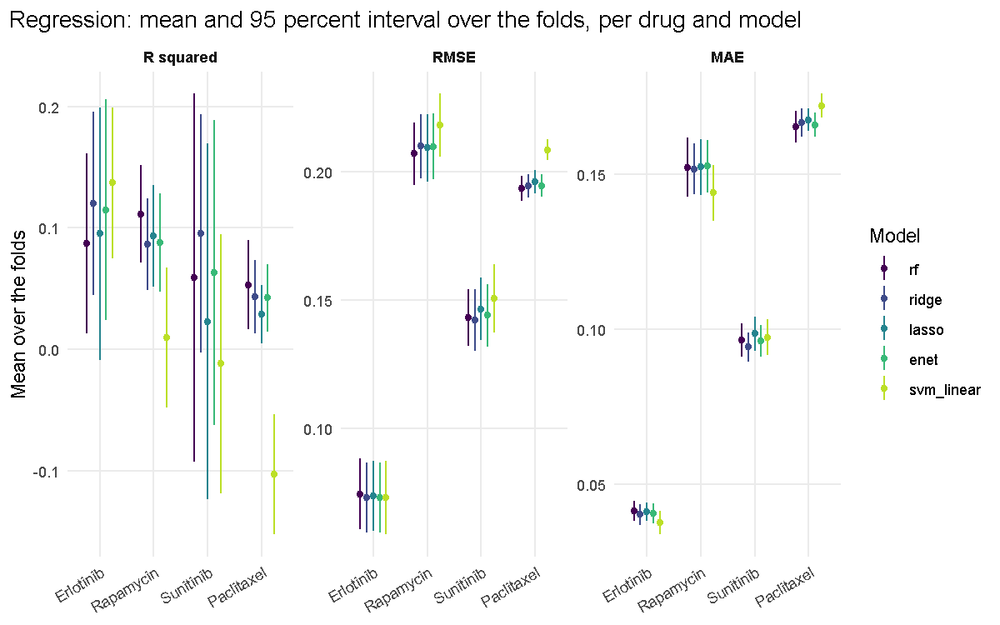
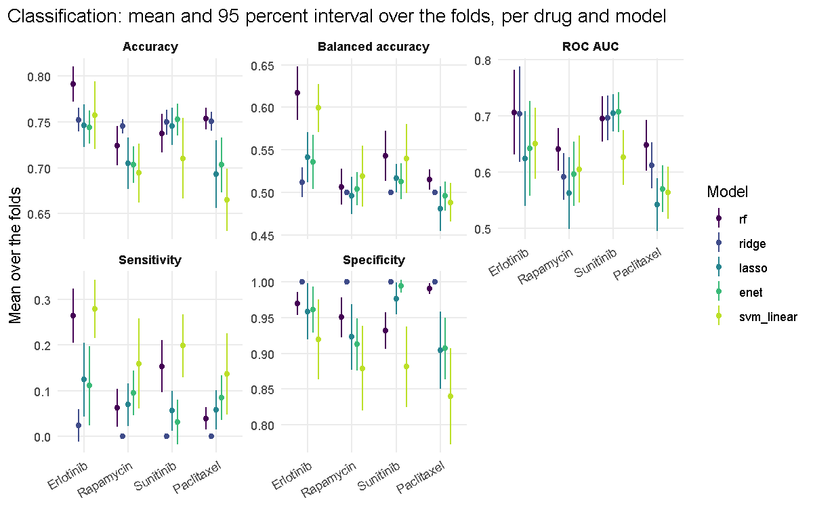

# Drug response prediction in cancer cell lines (GDSC v17.3 and DepMap 19Q1)

[](LICENSE)


**Predicting the drug response of cancer cell lines from gene expression with random forests, penalized regression and linear SVMs in R: the 2019 thesis code as deposited, a verified data download, a renv environment, an errata list and, in v1.0, a corrected reimplementation evaluated by repeated stratified cross-validation.**

R code of a Master's thesis that predicts the response of cancer cell lines
to a drug from their gene expression: the area under the dose-response curve
(AUC) of GDSC release 7.0 (v17.3) as response, the RNA-seq expression of
DepMap Public 19Q1 as predictors. The nine 2019 scripts are published
unchanged in `legacy/` except for text encoding and a provenance header;
v0.1.0 added a reproducible data download, a `renv` environment and a list of
errata of the 2019 code, and v1.0 (this release) adds a corrected
reimplementation in `R/` and `run_all.R` that fixes the eight errata items,
with unit tests and exported tables and figures. See the section
[v1.0: corrected reimplementation](#v10-corrected-reimplementation).

**Disclaimer:** this code is intended for research and teaching only. It is
not a clinical tool and must not be used to guide the treatment of any patient.

Master's thesis: MSc in Bioinformatics and Biostatistics, Universitat
Oberta de Catalunya and Universitat de Barcelona (UOC-UB), June 2019. Author:
Alfonso Esteban Lasso.

> The scripts in `legacy/` are published as deposited in June 2019 and keep
> their original Spanish comments; everything written for this repository
> after 2019 (this README, `legacy/README.md`, `data/README.md`,
> `docs/errata.md`, `scripts/00_download_data.R` and the whole of v1.0:
> `R/`, `run_all.R`, `tests/`, `docs/v1_spec.md` and
> `docs/comparison_2019_vs_v1.md`) is in English.

## Objective

The code predicts the response of cancer cell lines to a drug, measured as the
area under the dose-response curve (AUC) of GDSC release 7.0 (v17.3), from the
RNA-seq expression of DepMap Public 19Q1. For each drug it builds a cell line
by gene matrix (joined by COSMIC_ID), keeps the 200 most variable genes, and
fits random forests, ridge, lasso and elastic net (glmnet) and a linear SVM
(e1071), both as regression on the AUC and as classification of the cell
lines into sensitive and resistant. The thesis analysed four drugs:
erlotinib, rapamycin, sunitinib and paclitaxel.

The 2019 code (`legacy/`) tuned the random forests with h2o and caret,
discretised the AUC at its third quartile, and used an 80/20 split and a
60/20/20 split (cross-validation inside the training set where the package
supports it: 10-fold repeated five times in caret, 10-fold in glmnet and in
the SVM tuning; the h2o searches use training-frame metrics). The v1.0 code
keeps the same data, the same four drugs and the same five model families, and
replaces the evaluation and the defective steps as described below.

## Data & methods

This repository does **not** redistribute any data. `scripts/00_download_data.R`
downloads the GDSC file and verifies all three inputs by size and SHA-256;
files placed in `data/raw/` by hand are verified in the same way, and
everything under `data/` except its README is ignored by git.

- **GDSC release 7.0** (Wellcome Sanger Institute and Massachusetts General
  Hospital): `v17.3_fitted_dose_response.xlsx`, downloaded from the
  [GDSC download server](https://ftp.sanger.ac.uk/pub/project/cancerrxgene/releases/release-7.0/);
  non-exclusive licence for internal research and education, no resale.
- **DepMap Public 19Q1** (Broad Institute): `CCLE_depMap_19Q1_TPM.csv` and
  `DepMap-2019q1-celllines.csv`, CC BY 4.0. These two files are not in the
  figshare record of the Achilles 19Q1 release; `data/README.md` explains how
  to obtain them (the [DepMap portal](https://depmap.org) or the Bioconductor
  `depmap` package) and the script verifies them once placed in `data/raw/`.

Exit codes of the script: 0 when all three files are present and verified, 1
when a file does not match its expected size or SHA-256 (the script stops with
an error), 2 when a file is missing. The mode
`Rscript scripts/00_download_data.R --verify-only <directory>` only checks
files already present in a directory, without downloading anything.

Methods of the 2019 code: the nine legacy scripts implement the pipeline
summarised under Objective, one drug at a time. `creacionmatriz.R` builds the
cell line by gene matrix with the AUC column of the chosen drug, and each of
the eight model scripts fits its models twice, with the 80/20 split and with
the 60/20/20 split (hyperparameters tuned on the 20 percent validation subset,
final fit on the remaining 80 percent, test on the last 20 percent).
`legacy/README.md` maps each script to the thesis sections.

Methods of v1.0: the same per-drug matrix is built by `R/build_matrix.R`
(reusing the join logic of `creacionmatriz.R`, without the global gene
selection) and every model is evaluated by repeated stratified k-fold
cross-validation with fold-wise preprocessing and an inner resampling for
tuning. The binding specification is `docs/v1_spec.md`.

## Known limitations and errata

The 2019 code has seven methodological defects and one reproducibility
caveat, documented with file and line in the table of
[`docs/errata.md`](docs/errata.md) (titled "Errata of the 2019 code"). They
are left uncorrected in `legacy/`, which remains the code as deposited, and
are fixed by the v1.0 reimplementation (next section):

1. The R-squared is computed as the squared correlation between the observed
   value and the residual, which is not the coefficient of determination; the
   R-squared equal to 1 highlighted in the thesis is an artefact of that
   calculation.
2. `randomForest()` receives tuned arguments that it does not understand and
   silently ignores.
3. The 80/20 "elastic net" calls `cv.glmnet()` without `alpha` and is a lasso.
4. `caret::train()` performs a grid search, not the random search described.
5. The class label probably assigns "sensitive" to the most resistant quartile.
6. Gene selection and the class threshold are computed before the train/test
   split (information leakage).
7. The SVM regression uses 2000 genes instead of 200 and saves the wrong
   object; in the penalized logistic script three `predict()` calls have
   misplaced parentheses (without effect on the ROC curves).
8. The 2019 partitions and resampling are not reproduced exactly by a current
   R: the 60/20/20 split and the internal folds depend on `sample()` (changed
   in R 3.6.0) and on the random numbers consumed by earlier fits, and the
   h2o searches have no seed and a time budget.

The thesis results should be read with these limitations in mind.

`docs/errata.md` also lists further observations of the 2026 review (section
"Additional observations"), for example the sorting of the h2o grid in the
classification script and the sign of the SVM decision values used for its
ROC curves.

## v1.0: corrected reimplementation

v1.0 is a corrected reimplementation of the thesis pipeline, written as plain
R functions in `R/` with a command line runner `run_all.R`, kept separate
from `legacy/`, which is not modified. It uses the same three input files,
the same four drugs and the same five model families, and fixes the eight
errata items as follows (the specification, with grids, seeds, function
signatures and output layout, is `docs/v1_spec.md`):

| Erratum | Fix in v1.0 | Where |
|---|---|---|
| 1. R squared as `cor(y, residual)^2` | R squared is 1 minus SSres over SStot on the held-out fold, reported with RMSE and MAE | `R/metrics.R` |
| 2. `randomForest()` drops the tuned h2o arguments | The random forest is fitted with `ranger` using the hyperparameters that were tuned (`mtry`, `min.node.size`, `sample.fraction`, `max.depth`, `num.trees`); the tests check the fitted object | `R/models.R` |
| 3. The 80/20 "elastic net" is a lasso; two lambda rules | `alpha` tuned on the grid 0.1 to 0.9 for both tasks; `lambda.min` for every glmnet model and task | `R/models.R` |
| 4. Grid search labelled random search; mixed resampling | Every grid is declared in `model_grid()`; the random forest grid is sampled at random with a seed and a fixed budget (12 configurations, 6 with `--fast`); the same inner folds (`foldid`) are used by every model family | `R/cv.R`, `R/models.R` |
| 5. "Sensitive" assigned to the highest AUC quartile | Sensitive is AUC strictly below the first quartile of the training fold (lower AUC means more drug effect); `resistant` otherwise | `R/cv.R` |
| 6. Gene selection and threshold computed on the whole dataset | The 200 most variable genes and the class threshold are computed inside each outer training fold; a leakage check refits the glmnet models with the 2019 global procedure on the same folds and reports the difference | `R/cv.R`, `R/run_drug.R` |
| 7. SVM regression on 2000 genes; wrong saved object | The same standardised 200-gene matrix for every model, the SVM included; fitted objects (with `--save-models`) and tuning tables saved per fold | `R/models.R`, `R/run_drug.R` |
| 8. Partitions not reproducible | One base seed (`--seed`, default 2019) derived per task and split; fold assignments written to `outputs/<drug>/folds.csv`; h2o not used; package versions in `renv.lock` | `run_all.R`, `renv.lock` |

The additional observations of `docs/errata.md` are covered too: the ROC
scores are oriented towards the sensitive class (the SVM decision value is
negated when needed), the 60/20/20 scheme is replaced by cross-validation,
the ridge model with a degenerate lambda cannot occur because lambda is
chosen by inner cross-validation on the glmnet path, and no hyperparameter is
copied by hand.

**Evaluation design.** Repeated stratified 5-fold cross-validation with 3
repeats (`caret::createMultiFolds()` on the AUC quartile group for regression
and on a provisional sensitivity indicator for classification), an inner
stratified 5-fold resampling for tuning that is shared by every model family
of a split, and fold-wise preprocessing: gene selection by training-fold
variance, class threshold on the training fold, standardisation with
training-fold mean and standard deviation. Inner selection metric: RMSE for
regression, ROC AUC for classification. `--fast` uses 3 folds, 1 repeat, two
drugs (erlotinib and paclitaxel) and a random forest budget of 6, for smoke
runs. Metrics per held-out fold: R squared, RMSE and MAE for regression;
accuracy, balanced accuracy, ROC AUC (`pROC`), sensitivity and specificity for
classification. They are summarised per drug, task, model and metric with the
mean, the standard deviation and a two-sided 95 percent t-based interval over
the folds. Because the folds of different repeats share cell lines, that
interval is descriptive, not an exact inferential statement.

**Substitution of h2o.** The 2019 random forest searches ran in h2o (Java),
without seed and with a time budget, and their tuned values were then dropped
by `randomForest()` (erratum 2). v1.0 does not call h2o: the random forest is
fitted with `ranger`, which accepts the equivalents of the h2o parameters
directly (`mtry`, `min.node.size`, `sample.fraction` with `replace = FALSE`,
`max.depth`, `num.trees`; `nbins` has no equivalent and is dropped), is
deterministic given a seed and has no Java dependency. `caret` is used only
for `createMultiFolds()`; tuning is hand-rolled around `ranger`,
`glmnet::cv.glmnet()` and `e1071::svm()` so that the seeds, the shared inner
folds and the saved tuning tables are explicit and tested.

**Outputs.** `outputs/` holds, per drug and task, the metrics by fold, the
summary with intervals, the selected hyperparameters and every evaluated
candidate, the genes selected per split (counts), the timings, the leakage
check and the figures (box plots of the fold metrics, observed versus
predicted for regression, ROC curves for classification), plus the cross-drug
tables `outputs/summary.csv`, `outputs/summary_regression.md`,
`outputs/summary_classification.md` and their figures, and `outputs/run_log.txt`
with the command line, seeds, package versions and timings. The per cell line
predictions (`predictions.csv`) contain GDSC AUC values and are not committed;
fitted models are written only with `--save-models` and are ignored by git.

### Results of the full run

Full run of 2026-10-07 with the defaults (`k = 5`, `repeats = 3`, `k_inner
= 5`, `rf_budget = 12`, seed 2019, leakage check on); no lever of section 14
of `docs/v1_spec.md` was needed: 39.6 minutes of wall time with 11 `ranger`
threads (`--fast`: 1.2 minutes). Cells show the mean over the 15 held-out
folds and a two-sided 95 percent t-based interval; folds of different repeats
share cell lines, so the interval is descriptive, not an exact inferential
statement. About one cell line in four is `sensitive`, so a model that
predicts `resistant` for every line scores an accuracy of about 0.75, a
balanced accuracy of 0.5 and a sensitivity of 0. The tables are
`outputs/summary_regression.md` and `outputs/summary_classification.md`.

#### Regression

##### R squared

| Model | Erlotinib | Rapamycin | Sunitinib | Paclitaxel |
|---|---|---|---|---|
| rf | 0.087 (0.013 to 0.161) | 0.111 (0.071 to 0.152) | 0.059 (-0.093 to 0.211) | 0.053 (0.016 to 0.090) |
| ridge | 0.120 (0.045 to 0.196) | 0.087 (0.049 to 0.125) | 0.095 (-0.003 to 0.193) | 0.043 (0.013 to 0.073) |
| lasso | 0.095 (-0.009 to 0.199) | 0.093 (0.051 to 0.135) | 0.023 (-0.124 to 0.170) | 0.029 (0.005 to 0.053) |
| enet | 0.115 (0.024 to 0.206) | 0.088 (0.047 to 0.128) | 0.063 (-0.062 to 0.189) | 0.042 (0.014 to 0.070) |
| svm_linear | 0.137 (0.075 to 0.199) | 0.009 (-0.048 to 0.067) | -0.012 (-0.119 to 0.095) | -0.103 (-0.153 to -0.054) |

##### RMSE

| Model | Erlotinib | Rapamycin | Sunitinib | Paclitaxel |
|---|---|---|---|---|
| rf | 0.074 (0.061 to 0.088) | 0.207 (0.195 to 0.219) | 0.143 (0.132 to 0.154) | 0.193 (0.189 to 0.198) |
| ridge | 0.073 (0.059 to 0.087) | 0.210 (0.198 to 0.222) | 0.142 (0.130 to 0.154) | 0.195 (0.190 to 0.199) |
| lasso | 0.074 (0.060 to 0.087) | 0.209 (0.196 to 0.223) | 0.147 (0.135 to 0.159) | 0.196 (0.191 to 0.201) |
| enet | 0.073 (0.060 to 0.087) | 0.210 (0.197 to 0.223) | 0.144 (0.132 to 0.156) | 0.195 (0.190 to 0.199) |
| svm_linear | 0.073 (0.059 to 0.087) | 0.218 (0.206 to 0.231) | 0.151 (0.137 to 0.164) | 0.209 (0.205 to 0.213) |

##### MAE

| Model | Erlotinib | Rapamycin | Sunitinib | Paclitaxel |
|---|---|---|---|---|
| rf | 0.041 (0.038 to 0.045) | 0.152 (0.143 to 0.162) | 0.097 (0.091 to 0.102) | 0.165 (0.160 to 0.170) |
| ridge | 0.040 (0.037 to 0.044) | 0.152 (0.143 to 0.160) | 0.094 (0.090 to 0.099) | 0.167 (0.162 to 0.171) |
| lasso | 0.041 (0.038 to 0.044) | 0.152 (0.143 to 0.161) | 0.099 (0.093 to 0.104) | 0.168 (0.164 to 0.171) |
| enet | 0.041 (0.037 to 0.044) | 0.153 (0.144 to 0.161) | 0.096 (0.091 to 0.101) | 0.166 (0.162 to 0.170) |
| svm_linear | 0.038 (0.034 to 0.041) | 0.144 (0.135 to 0.153) | 0.097 (0.092 to 0.103) | 0.172 (0.168 to 0.176) |



#### Classification

##### Accuracy

| Model | Erlotinib | Rapamycin | Sunitinib | Paclitaxel |
|---|---|---|---|---|
| rf | 0.791 (0.772 to 0.811) | 0.724 (0.703 to 0.746) | 0.738 (0.717 to 0.759) | 0.754 (0.742 to 0.765) |
| ridge | 0.752 (0.739 to 0.766) | 0.745 (0.738 to 0.753) | 0.750 (0.736 to 0.764) | 0.751 (0.741 to 0.761) |
| lasso | 0.746 (0.723 to 0.769) | 0.705 (0.677 to 0.733) | 0.745 (0.725 to 0.765) | 0.693 (0.656 to 0.730) |
| enet | 0.744 (0.726 to 0.762) | 0.704 (0.684 to 0.724) | 0.753 (0.735 to 0.770) | 0.703 (0.674 to 0.733) |
| svm_linear | 0.757 (0.720 to 0.794) | 0.694 (0.662 to 0.727) | 0.710 (0.666 to 0.754) | 0.665 (0.631 to 0.699) |

##### Balanced accuracy

| Model | Erlotinib | Rapamycin | Sunitinib | Paclitaxel |
|---|---|---|---|---|
| rf | 0.617 (0.585 to 0.648) | 0.506 (0.485 to 0.528) | 0.543 (0.513 to 0.572) | 0.515 (0.503 to 0.527) |
| ridge | 0.512 (0.494 to 0.530) | 0.500 (0.500 to 0.500) | 0.500 (0.500 to 0.500) | 0.500 (0.500 to 0.500) |
| lasso | 0.542 (0.512 to 0.571) | 0.496 (0.474 to 0.518) | 0.516 (0.500 to 0.533) | 0.481 (0.455 to 0.508) |
| enet | 0.536 (0.504 to 0.568) | 0.504 (0.485 to 0.524) | 0.513 (0.492 to 0.534) | 0.496 (0.478 to 0.513) |
| svm_linear | 0.599 (0.571 to 0.627) | 0.519 (0.483 to 0.555) | 0.540 (0.499 to 0.581) | 0.488 (0.466 to 0.511) |

##### ROC AUC

| Model | Erlotinib | Rapamycin | Sunitinib | Paclitaxel |
|---|---|---|---|---|
| rf | 0.706 (0.630 to 0.781) | 0.640 (0.602 to 0.677) | 0.694 (0.654 to 0.735) | 0.647 (0.602 to 0.692) |
| ridge | 0.703 (0.618 to 0.788) | 0.591 (0.549 to 0.633) | 0.696 (0.657 to 0.736) | 0.611 (0.570 to 0.652) |
| lasso | 0.624 (0.539 to 0.708) | 0.562 (0.498 to 0.626) | 0.705 (0.672 to 0.738) | 0.542 (0.495 to 0.589) |
| enet | 0.642 (0.557 to 0.726) | 0.596 (0.539 to 0.653) | 0.706 (0.671 to 0.742) | 0.570 (0.528 to 0.611) |
| svm_linear | 0.650 (0.587 to 0.714) | 0.605 (0.545 to 0.665) | 0.626 (0.577 to 0.674) | 0.563 (0.516 to 0.610) |

##### Sensitivity

| Model | Erlotinib | Rapamycin | Sunitinib | Paclitaxel |
|---|---|---|---|---|
| rf | 0.264 (0.205 to 0.323) | 0.063 (0.021 to 0.104) | 0.154 (0.097 to 0.210) | 0.039 (0.015 to 0.064) |
| ridge | 0.024 (-0.011 to 0.060) | 0.000 (0.000 to 0.000) | 0.000 (0.000 to 0.000) | 0.000 (0.000 to 0.000) |
| lasso | 0.124 (0.044 to 0.205) | 0.070 (0.023 to 0.116) | 0.056 (0.013 to 0.100) | 0.058 (0.015 to 0.102) |
| enet | 0.111 (0.024 to 0.198) | 0.096 (0.047 to 0.145) | 0.032 (-0.016 to 0.081) | 0.085 (0.036 to 0.133) |
| svm_linear | 0.279 (0.215 to 0.343) | 0.159 (0.061 to 0.258) | 0.199 (0.130 to 0.267) | 0.137 (0.048 to 0.226) |

##### Specificity

| Model | Erlotinib | Rapamycin | Sunitinib | Paclitaxel |
|---|---|---|---|---|
| rf | 0.970 (0.954 to 0.985) | 0.950 (0.923 to 0.978) | 0.932 (0.906 to 0.958) | 0.990 (0.983 to 0.998) |
| ridge | 1.000 (1.000 to 1.000) | 1.000 (1.000 to 1.000) | 1.000 (1.000 to 1.000) | 1.000 (1.000 to 1.000) |
| lasso | 0.959 (0.919 to 0.998) | 0.923 (0.877 to 0.969) | 0.977 (0.954 to 0.999) | 0.904 (0.850 to 0.958) |
| enet | 0.961 (0.928 to 0.993) | 0.913 (0.876 to 0.949) | 0.994 (0.985 to 1.003) | 0.907 (0.864 to 0.950) |
| svm_linear | 0.919 (0.863 to 0.976) | 0.879 (0.819 to 0.938) | 0.881 (0.825 to 0.938) | 0.840 (0.773 to 0.907) |



In short: the 200 most variable genes explain at most about a tenth of the
AUC variance of unseen cell lines (best R squared 0.137 for erlotinib with the
linear SVM, 0.111 for rapamycin with the random forest), and in
classification most models rank the lines better than chance (ROC AUC 0.6 to
0.7) while few beat the trivial classifier in balanced accuracy (the random
forest and the linear SVM for erlotinib, the random forest for sunitinib).
The leakage check shows that the 2019 global gene selection and threshold
change the `glmnet` estimates by at most 0.015 in ROC AUC and 0.020 in
R squared on these data. The comparison with the numbers of the 2019 thesis,
and the reasons why most of them cannot be compared directly (the 2019 "R2"
is not a coefficient of determination, the 2019 class label is inverted, the
2019 splits are not reproducible), is in
[`docs/comparison_2019_vs_v1.md`](docs/comparison_2019_vs_v1.md).

## Tech stack

R 4.3 with a `renv` lockfile (`renv.lock`, `.Rprofile`).

- v1.0: ranger (random forest), glmnet (ridge, lasso, elastic net), e1071
  (linear SVM), pROC (ROC AUC), caret (only `createMultiFolds()`), ggplot2
  and viridisLite (figures), data.table and readxl (reading), testthat (unit
  tests on synthetic data). No h2o, no Java.
- Legacy scripts: caret, glmnet, randomForest, e1071, h2o (needs a Java
  runtime), caTools, ROCR, miscTools, readxl, data.table, plyr, resample,
  ggplot2.
- Download script: digest and jsonlite.

## How to run

### v1.0 (recommended)

1. Install R 4.3 or later and, on Windows, Rtools. No Java is needed.

2. Restore the package environment (run every `Rscript` command from the
   repository root, so that `.Rprofile` activates `renv`):

   ```bash
   Rscript -e "renv::restore()"
   ```

3. Download and verify the data (the two DepMap files must be placed in
   `data/raw/` by hand; the script says so and verifies them):

   ```bash
   Rscript scripts/00_download_data.R
   ```

4. Run the unit tests (synthetic data, no raw file needed, well under a
   minute):

   ```bash
   Rscript -e "testthat::test_dir('tests/testthat')"
   ```

5. Smoke run, then the full run (four drugs, both tasks, 5 folds by 3
   repeats; the budget of `docs/v1_spec.md` is about 45 minutes on a desktop
   with 12 logical cores, and the measured wall time is in the run record of
   the results section above):

   ```bash
   Rscript run_all.R --fast
   Rscript run_all.R
   ```

   Options: `--drug erlotinib,paclitaxel` (any `DRUG_NAME` of the GDSC file
   that maps to one `DRUG_ID`, case-insensitive), `--task
   regression|classification|both`, `--outdir outputs`, `--seed 2019`,
   `--folds 5`, `--repeats 3`, `--inner-folds 5`, `--rf-budget 12`,
   `--threads N`, `--no-leakage-check`, `--refresh-cache` (rebuilds the
   per-drug matrices cached under `data/derived/`), `--save-models`. Explicit
   arguments override `--fast`. Exit code 0 on success, 1 on any error;
   missing raw files produce an error that points to
   `scripts/00_download_data.R`.

### Legacy scripts (2019 code, as deposited)

1. Install a Java runtime supported by the installed h2o version (needed only
   by the two h2o scripts; the environment builds without it).

2. Run the legacy scripts from `data/raw/`, which holds the three input
   files, in an R session started at the project root so that `renv` is active
   (open `gdsc-depmap-drug-response-r.Rproj` or run R there). Source
   `creacionmatriz.R` first, which builds the matrix, and then any model
   script in the same way:

   ```r
   setwd("data/raw")
   source("../../legacy/creacionmatriz.R")
   source("../../legacy/h2ocontinuosRF.R")
   ```

Note: the legacy scripts read and write by relative file name in the working
directory (`.rds` matrices and `.RData` fitted models, ignored by git).
Figures and console summaries are produced interactively; the scripts do not
export any figure or table. The 2019 random partitions are not reproduced
exactly by a current R: see item 8 of `docs/errata.md` and `legacy/README.md`.

## Repository structure

```
gdsc-depmap-drug-response-r/
├── R/                                                  # v1.0: plain R functions sourced by run_all.R and the tests
│   ├── build_matrix.R                                  # per-drug cell line by gene matrix (join logic of creacionmatriz.R, no global gene selection)
│   ├── cv.R                                            # stratified outer and inner folds, fold-wise gene selection, class rule, standardisation
│   ├── models.R                                        # rf (ranger), ridge, lasso, enet (glmnet), svm_linear (e1071) with declared grids and tuning
│   ├── metrics.R                                       # R squared, RMSE, MAE, accuracy, balanced accuracy, ROC AUC, sensitivity, specificity, t intervals
│   ├── run_drug.R                                      # runs one drug and task over the folds, leakage check, writes outputs/<drug>/<task>/
│   └── report.R                                        # figures and cross-drug summary tables
├── run_all.R                                           # v1.0 command line runner (--fast, --drug, --task, --outdir, --seed, ...)
├── tests/
│   ├── testthat.R
│   └── testthat/                                       # unit tests on a synthetic matrix generated in the tests (no raw data)
├── outputs/                                            # v1.0 results of the full run (aggregate tables, fold assignments, figures; predictions and models not committed)
│   ├── run_log.txt
│   ├── summary.csv                                     # all drugs, tasks, models and metrics
│   ├── summary_regression.md
│   ├── summary_classification.md
│   ├── fig_summary_regression.png
│   ├── fig_summary_classification.png
│   └── <drug>/                                         # folds.csv and one folder per task with metrics, tuning, selected genes, leakage check and figures
├── legacy/                                             # the nine scripts deposited with the thesis (UTF-8, provenance header), not modified
│   ├── README.md                                       # script-to-thesis-section map, how to run them, original environment
│   ├── creacionmatriz.R                                # cell line by gene matrix joined by COSMIC_ID (run first)
│   ├── h2ocontinuosRF.R                                # random forest regression, h2o search (needs Java)
│   ├── h2odiscretizadosRF.R                            # random forest classification, h2o search (needs Java)
│   ├── randomsearchcontinuosRF.R                       # random forest regression tuned with caret
│   ├── randomsearchdiscretizadosRF.R                   # random forest classification tuned with caret
│   ├── ridgelassoelasticcontinuosrandomsearch.R        # ridge, lasso and elastic net regression (glmnet)
│   ├── ridgelassoelasticdiscretizadosrandomsearch.R    # penalized logistic regression (glmnet)
│   ├── SVMLinealcontinuos.R                            # linear SVM regression (e1071)
│   └── SVMLinealdiscretizados.R                        # linear SVM classification (e1071)
├── scripts/
│   └── 00_download_data.R                              # downloads the GDSC file, verifies size and SHA-256 of the three inputs
├── data/
│   ├── README.md                                       # sources, licences, expected sizes and hashes; v1.0 note on the derived cache
│   ├── raw/                                            # input files (created locally, ignored by git)
│   └── derived/                                        # per-drug matrices cached by v1.0 (created locally, ignored by git)
├── docs/
│   ├── errata.md                                       # eight items of the 2019 code and additional observations
│   ├── v1_spec.md                                      # binding specification of v1.0 (data flow, folds, seeds, grids, outputs, tests) and its implementation record
│   └── comparison_2019_vs_v1.md                        # the 2019 thesis numbers next to the v1.0 numbers, and what cannot be compared
├── renv/                                               # activate.R, settings.json and its own .gitignore (the project library is not versioned)
│   ├── activate.R
│   └── settings.json
├── renv.lock                                           # package versions of the reproducible environment (R 4.3)
├── .Rprofile                                           # activates renv when R starts at the project root
├── .gitignore                                          # ignores data/ (except its README), *.rds, *.RData, *.xlsx, *.csv (except outputs/**/*.csv), predictions.csv, models/ and renv/library/
├── gdsc-depmap-drug-response-r.Rproj                   # RStudio project file (open it to start R at the root)
├── CITATION.cff                                        # citation metadata for the code and the thesis
├── LICENSE                                             # MIT, the author's code only
└── README.md
```

## Provenance note

Supervised at the Bioinformatics Unit of the Spanish National Cancer Research
Centre (CNIO) by Dr. Héctor Tejero Franco, with Jeroni Luna (UOC) as academic
tutor. The thesis (in Spanish) is deposited at
<https://hdl.handle.net/10609/97486> under a CC BY-NC-ND 3.0 ES licence; it is
linked here, not copied.

The scripts in `legacy/` are published for transparency and traceability, as
deposited in June 2019, with Spanish comments and the hyperparameters chosen
at the time written by hand. No figures or tables are exported; the only
files they write are the `.rds` matrices and the `.RData` fitted models.
`legacy/README.md` maps each script to the thesis sections and describes the
original environment (R 3.5.1 on Ubuntu 18.04 and the package versions as
listed in the thesis).

What each release is, and what it is **not**:

- **v0.1.0:** the code deposited with the thesis, unchanged except for text
  encoding and a provenance header, plus a reproducible data download, a
  `renv` environment and a list of errata of the 2019 code. It is **not** a
  corrected version: the defects listed in the errata are left as they are.
- **v1.0 (this release):** a corrected reimplementation (functions instead of
  repeated blocks, correct metrics, gene selection and thresholds inside the
  training folds, the random forest fitted with its tuned hyperparameters, one
  feature set and one lambda rule for every model, fixed seeds and saved
  partitions, unit tests, exported figures and tables), kept separate from the
  legacy code, which stays as deposited. The v1.0 numbers are not a
  reproduction of the thesis numbers and do not claim to be: see
  `docs/comparison_2019_vs_v1.md`.

## License

The author's code is released under the MIT License (see `LICENSE`). The data
remain under the terms of their providers and are not part of this
repository. The thesis is linked under its own CC BY-NC-ND 3.0 ES licence and
is not redistributed here.

## How to cite

Use the metadata in `CITATION.cff` (GitHub shows a "Cite this repository"
button) and cite the thesis:

Esteban Lasso, A. (2019). *Predicción de respuesta a fármacos
quimioterapéuticos a partir de datos genómicos*. Master's thesis, Universitat
Oberta de Catalunya and Universitat de Barcelona.
<https://hdl.handle.net/10609/97486>

## Acknowledgements

Model fitting follows the public documentation and tutorials of the time for
caret, glmnet, randomForest, e1071 and h2o, and, for v1.0, the documentation
of ranger, glmnet, e1071 and pROC. Thanks to the GDSC and DepMap projects for
making their data publicly available.
